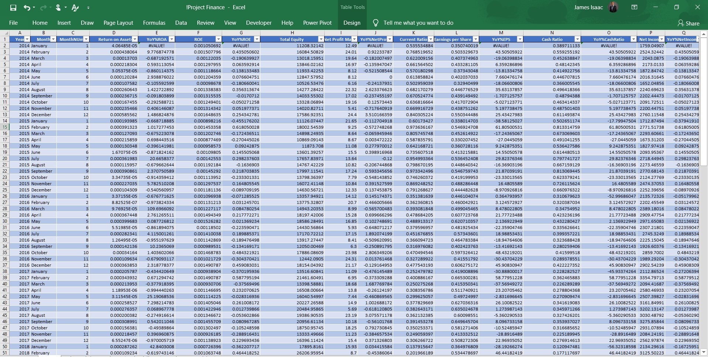
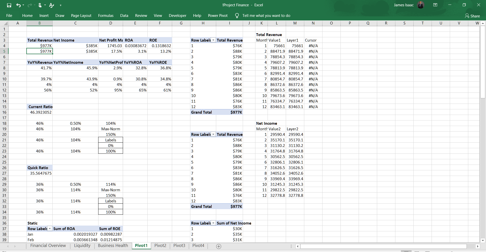
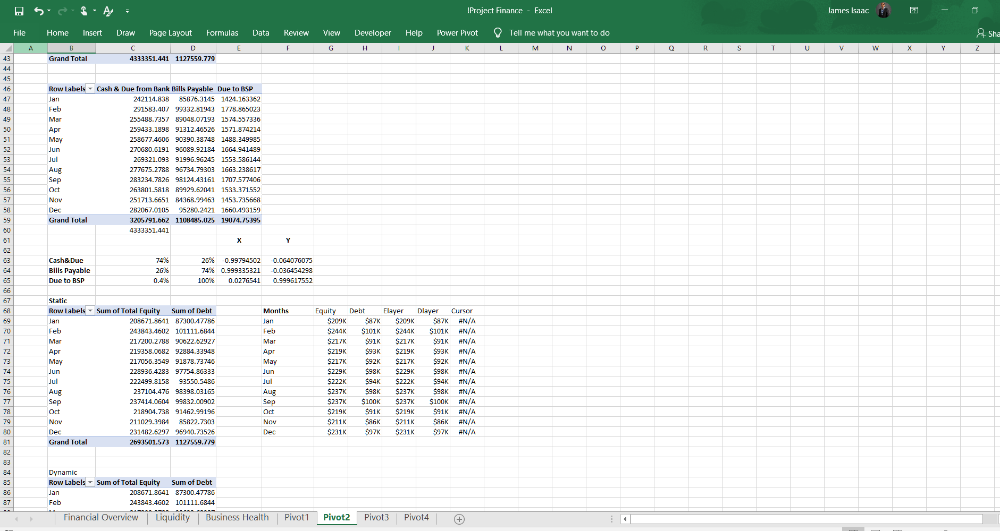
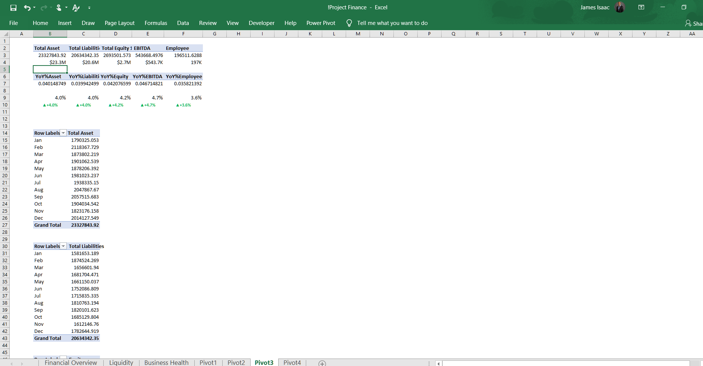
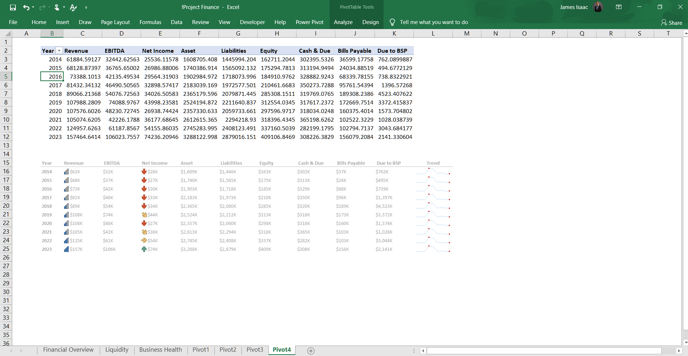
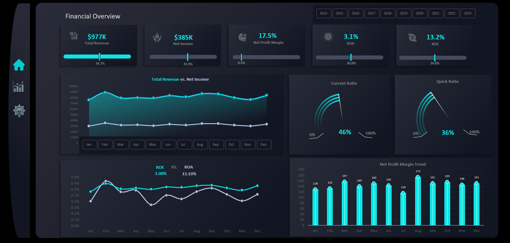
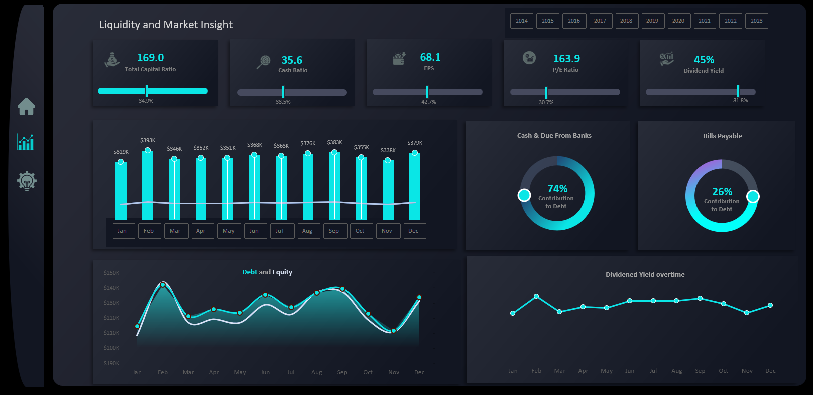
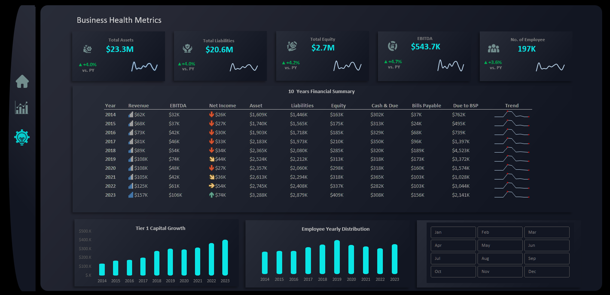

# Financial Performance and Liquidity Analysis (2014-2023)

## Introduction
In today’s fast-paced business environment, financial transparency and data-driven decision-making are crucial for success. Organizations need a clear picture of their revenue trends, profitability, liquidity, and overall financial health to make informed strategic choices. However, many companies struggle with scattered financial data, making it difficult to extract meaningful insights.

This project aims to solve that challenge by building interactive financial dashboards in Excel that provide a comprehensive view of an organization’s financial standing. The dashboards utilize dynamic visualizations to track revenue, net income, profitability margins, liquidity ratios, and other key financial indicators. With these insights, businesses can optimize financial performance, improve cash flow management, and boost investor confidence.

## About the dataset 
The dataset consists of financial data spanning fro 10 years (2014-2023), including key metrics such as:
- Total Revenue and Net Income
- Profitability Ratios (Net Profit Margin, Return on Assets, Return on Equity)
- Liquidity Ratios (Current Ratio, Quick Ratio, Cash Ratio)
- Debt and Equity Analysis
- Employee Distribution and Financial Summary

The data was cleaned, structured, and visualized to unlock hidden patterns and improve financial transparency.

## The Challenge
The organization faced significant financial challenges, including:

- Unclear profitability trends, leading to poor decision-making.
- Cash flow issues, making it difficult to manage daily operations.
- Lack of financial transparency, reducing investor confidence.
- Missed growth opportunities due to the inability to identify revenue patterns.
  
To tackle these issues, I leveraged Excel’s advanced analytics and visualization tools to build dashboards that provide actionable insights.

## Excel Concepts Applied
To transform raw financial data into meaningful insights, the following Excel techniques were utilized:

- Pivot Tables & Pivot Charts – Summarizing financial trends dynamically.
- Advanced Formulas (LOOKUP, IF, INDEX-MATCH, SUMIF) – Enabling accurate financial calculations.
- Conditional Formatting – Highlighting profitability trends, risks, and opportunities.
- Dynamic Charts & Slicers – Enhancing visualization and user experience.

  ## Pivot Tables and Analysis
Analysis 1                        | Analysis 2
:--------------------------------:|:-------------------------:
                |  
Analysis 3                        |  Analysis 4                   
                |    

  
## Visualization – Key Insights from the Dashboards
#### Financial Overview
[Watch Video](https://drive.google.com/file/d/11jwWj--EIIwwmcrXxQSrwDPI2i4CKIRJ/view?usp=sharing)

- Total Revenue: $977K, with a 39.7% contribution from key revenue streams.
- Net Income: $385K, representing 43.9% profit retention after expenses.
- Net Profit Margin: 17.5%, showing stable profitability but room for improvement.
- Return on Assets (ROA): 3.1%, indicating how efficiently assets generate profits.
- Return on Equity (ROE): 13.2%, reflecting how well shareholder investments are performing.

#### Liquidity and Market Insight

- Total Capital Ratio: 169.0, with a strong capital base.
- Cash Ratio: 35.6, ensuring the organization can cover short-term liabilities.
- Earnings Per Share (EPS): 68.1, reflecting positive investor returns.
- P/E Ratio: 163.9, showing investor expectations of future growth.
- Dividend Yield: 45%, demonstrating a high return for shareholders.
- Cash & Due from Banks: 74% contribution to debt, revealing significant bank dependencies.
- Bills Payable: 26% contribution to debt, requiring better management to avoid liquidity risks.

  #### Business Health Metrics
  
- Total Assets: $23.3M, showing steady financial growth.
- Total Liabilities: $20.6M, highlighting significant financial obligations.
- Total Equity: $2.7M, growing at a 4.2% rate year-over-year.
- EBITDA: $543.7K, reflecting earnings before interest, tax, depreciation, and amortization.
- Employee Count: 197K, with 3.6% year-over-year growth, indicating business expansion.
